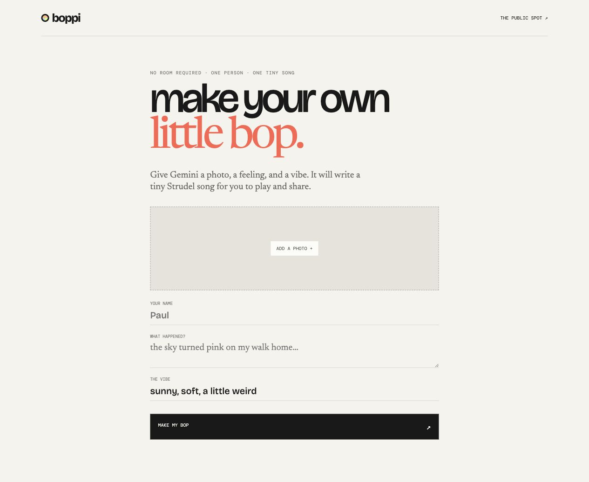

# boppi

[](https://boppi.vercel.app)
[](https://bun.sh)
[](https://convex.dev)



## Little moments. One tiny song.

Boppi is a private room for 2–4 friends—or a one-person public Bop. Add a photo, a feeling, and a vibe. Together, they become a tiny song you can share.

**[Open Boppi →](https://boppi.vercel.app)**

## Why it is fun

- One little thing per person, per day
- A playful shared room instead of a feed
- A tiny song made from the room’s moments
- A public, read-only link to share with friends
- A public spot where little Bops can be discovered

## Built with

Next.js · React · TypeScript · Bun · Convex · Gemini · Strudel · Vercel

## Run it

```bash
bun install
bunx convex dev
bun run dev
```

Open [localhost:3000](http://localhost:3000).

## The cool part: Gemini writes the music

When someone adds a moment, Gemini looks at the image and caption. When a Bop is made, Gemini acts as the tiny music director: it chooses the mood, writes a safe Strudel pattern with melody, bass, and rhythm, and saves that code with the shareable Bop.

Strudel then performs the code in the browser. That means the music is immediate, remixable, and does not need an ElevenLabs audio file or API call. The app still works without Gemini using a built-in fallback pattern.

To enable Gemini, add this to the **production Convex deployment**—not `.env.local` and not a `NEXT_PUBLIC_*` value:

```bash
bunx convex env set GEMINI_API_KEY "..." --prod
```

Gemini calls happen in the Convex background action after a photo or standalone Bop is created. Convex handles the room, database, realtime updates, and storage either way.

Strudel is pinned as `@strudel/web@1.0.3` and is licensed under AGPL-3.0-or-later. If you distribute this integration, keep the source and follow Strudel&apos;s license terms.

## Links

- [Live app](https://boppi.vercel.app)
- [Make a public Bop](https://boppi.vercel.app/create)
- [Visit the public spot](https://boppi.vercel.app/spot)
- [GitHub](https://github.com/pol-cova/boppi)

Made for close friends and ordinary good days.
